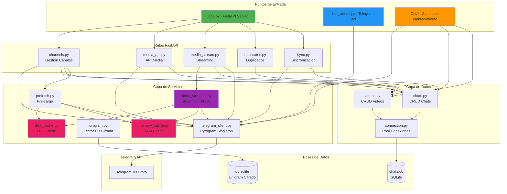

# Documentación Técnica del Sistema

> **Proyecto**: Gestor de Videos de Telegram con Streaming Híbrido y Caché Inteligente  
> **Framework**: FastAPI + Pyrogram  
> **Base de Datos**: SQLite (aiosqlite) + Unigram (sqlcipher)  
> **Fecha**: Enero 2026

---

## Tabla de Contenidos

1. [Arquitectura del Sistema](#arquitectura-del-sistema)
2. [Catálogo de Módulos](#catálogo-de-módulos)
3. [Guía de CLI](#guía-de-cli)
4. [API & Rutas](#api--rutas)
5. [Configuración](#configuración)
6. [Base de Datos](#base-de-datos)

---

## Arquitectura del Sistema

### Diagrama de Arquitectura



### Flujo de Datos Principal

#### 1. **Flujo de Streaming de Video**
```
Usuario → FastAPI (/stream/{video_id}) → video_streamer.py
    ↓
    ├─→ Buscar en Disk Cache (LRU)
    ├─→ Buscar en RAM Cache
    └─→ Descargar de Telegram (fallback)
         ↓
         └─→ Guardar en ambos caches
```

#### 2. **Flujo de Detección de Videos (Bot)**
```
Telegram → bot_videos.py (Pyrogram Client)
    ↓
    ├─→ Detectar mensaje con video
    ├─→ Encolar tarea de descarga
    ├─→ Descargar thumbnail
    └─→ Guardar metadata en JSON + BD
```

#### 3. **Flujo de Sincronización**
```
CLI/Web → sync.py → Telegram Raw API
    ↓
    ├─→ Obtener dialogs (folders: Inbox, Archivados)
    ├─→ Procesar información de chats
    └─→ Actualizar chats.db (last_message_date, etc.)
```

### Componentes Clave

#### **Sistema de Caché Híbrido**
- **Disk Cache**: LRU con límite configurable (ej. 2GB)
- **RAM Cache**: Almacena chunks recientes + metadata
- **Prefetch**: Pre-carga 5MB inicial de videos populares
- **Eviction**: Elimina archivos más antiguos cuando se excede límite

#### **Cliente Telegram Singleton**
- Pool de sesiones con clonación para evitar locks
- Reconexión automática con reintentos
- Warmup de caché de diálogos al inicio
- Manejo robusto de FloodWait y errores de red

#### **Sistema de Duplicados**
- Detección por múltiples criterios: nombre, duración, tamaño, thumbnail
- Similitud visual usando ResNet18 (PyTorch)
- Clustering con Union-Find
- Marcado no destructivo (oculto=3)

---

## Catálogo de Módulos

### 📁 **Raíz del Proyecto**

#### `app.py` - **Punto de Entrada Principal (FastAPI)**
**Responsabilidad**: Servidor web y API REST

**Funciones Clave**:
- `lifespan()`: Gestión del ciclo de vida de la app
  - Inicializa base de datos
  - Inicia cliente Telegram (sesión servidor)
  - Pre-carga caché inteligente
  - Registra todos los routers
- Configuración de logging
- Montaje de archivos estáticos
- Servidor Uvicorn en puerto configurable

**Tecnologías**: FastAPI, Uvicorn, aiosqlite, Pyrogram

---

#### `bot_videos.py` - **Bot de Telegram**
**Responsabilidad**: Detección automática y descarga de videos

**Funciones Clave**:
- `handle_message()`: Handler de mensajes con videos
- `worker_descargas()`: Worker asíncrono para descargas
- `descargar_thumbnail_async()`: Descarga y convierte thumbnails a WebP
- Manejo de cola con `asyncio.Queue`
- Gestión de FloodWait con esperas automáticas
- Guardado de metadata en JSON y base de datos

**Características**:
- Procesamiento concurrente con límite de workers
- Reintentos automáticos en caso de error
- Guardado incremental de progreso

---

#### `config.py` - **Configuración Centralizada**
**Responsabilidad**: Carga y validación de variables de entorno

**Categorías de Configuración**:
1. **Telegram API**: API_ID, API_HASH, SESSION_NAME
2. **Bots**: BOT_TOKEN, BOT_POOL_TOKENS (pool de bots workers)
3. **Rutas**: DB_PATH, THUMB_FOLDER, JSON_FOLDER, CACHE_DIR
4. **Streaming**: CHUNK_SIZE, BUFFER_SIZE, REQUEST_TIMEOUT
5. **Smart Cache**: MAX_DISK_CACHE_SIZE, TARGET_VIDEO_CACHE_SIZE
6. **Server**: HOST, PORT, LOG_LEVEL
7. **FFmpeg**: Configuración para sprites y procesamiento

**Funciones**:
- `ensure_dir()`: Crea directorios necesarios
- Validación de valores requeridos

---

### 📁 **database/** - Capa de Acceso a Datos

#### `connection.py` - **Gestor de Conexiones**
**Responsabilidad**: Pool de conexiones SQLite con configuración optimizada

**Características**:
- Conexiones asíncronas con `aiosqlite`
- PRAGMAs optimizados: WAL mode, cache_size, mmap_size
- Reintentos automáticos en caso de lock
- Funciones síncronas para mantenimiento
- `init_db()`: Inicialización y migraciones de schema

**PRAGMAs Aplicados**:
```sql
journal_mode=WAL
synchronous=NORMAL
cache_size=-64000 (64MB)
mmap_size=268435456 (256MB)
temp_store=MEMORY
```

---

#### `chats.py` - **CRUD de Chats**
**Responsabilidad**: Operaciones sobre tablas de chats y carpetas

**Funciones Principales**:
- `db_upsert_chat()`: Insertar/actualizar chat con metadata completa
- `db_get_all_chats()`: Obtener todos los chats con filtros
- `db_upsert_chat_video_count()`: Actualizar contadores de videos
- `db_get_or_create_folder()`: Gestión de carpetas (Inbox, Archivados)
- `db_add_chat_to_folder()`: Asociar chat con carpeta

**Tablas Gestionadas**:
- `chats`: Información de chats/canales
- `chat_folders`: Carpetas de organización
- `chat_video_counts`: Contadores (total, indexados, duplicados)

---

#### `videos.py` - **CRUD de Videos**
**Responsabilidad**: Operaciones sobre videos y mensajes de video

**Funciones Principales**:
- `db_upsert_video()`: Insertar/actualizar video con metadata
- `db_upsert_video_message()`: Gestión de mensajes de video
- `db_get_videos()`: Consulta con filtros, ordenamiento y paginación
- `db_count_videos_by_chat()`: Conteo por chat
- `db_add_video_file_id()`: Tracking de file_ids alternativos
- Schema migrations automáticas

**Tablas Gestionadas**:
- `videos_telegram`: Metadata de videos
- `video_messages`: Relación video-mensaje
- `video_file_ids`: IDs alternativos para mismo video

---

### 📁 **services/** - Capa de Servicios

#### `telegram_client.py` - **Cliente Singleton de Telegram**
**Responsabilidad**: Gestión unificada de sesiones Pyrogram

**Características**:
- Patrón Singleton con lock thread-safe
- Pool de sesiones clonadas para CLI
- `warmup_cache()`: Pre-carga de diálogos al inicio
- Reconexión automática con reintentos exponenciales
- Manejo de múltiples sesiones simultáneas

**Funciones Clave**:
- `get_client()`: Obtener instancia (con opción de clonar)
- `start_client()`: Iniciar cliente con retry logic
- `reconnect_if_needed()`: Verificación y reconexión
- `stop_client()`: Detener limpiamente

---

#### `unigram.py` - **Lector de Base Unigram**
**Responsabilidad**: Acceso a base de datos cifrada de Unigram

**Funciones**:
- `get_dialogs_with_decoded_message_id()`: Obtener diálogos con fechas de último mensaje
- Desencriptación con `sqlcipher3`
- Filtrado por carpetas (folder_id)
- Decodificación de message_id comprimidos

**Uso**: Sincronización incremental desde cliente Unigram nativo

---

#### `video_streamer.py` - **Streaming Híbrido**
**Responsabilidad**: Servir videos con estrategia de caché multinivel

**Clase Principal**: `TelegramVideoSender`

**Flujo de Streaming**:
1. Buscar en caché de disco (más rápido)
2. Buscar en caché RAM
3. Descargar de Telegram con reintentos
4. Guardar en ambos caches para futuros accesos

**Características**:
- Soporte para HTTP Range Requests
- Manejo de cancelaciones
- Reintentos con backoff exponencial
- Headers optimizados para streaming
- Generación automática de Content-Length

---

#### `disk_cache.py` - **Caché LRU en Disco**
**Responsabilidad**: Gestión de caché con eviction policy

**Funciones**:
- `get_cache_path()`: Ruta de archivo en caché
- `get_cache_size()`: Cálculo de espacio usado
- `evict_until_under_limit()`: Liberación de espacio (LRU)
- `save_to_cache()`: Guardar chunk con actualización de timestamp
- `update_cache_timestamp()`: Marcar como usado recientemente

**Algoritmo**: Least Recently Used (LRU) basado en `st_mtime`

---

#### `memory_cache.py` - **Caché RAM**
**Responsabilidad**: Caché en memoria para acceso ultra-rápido

**Estructura**:
```python
_RAM_CACHE = {
    "video_key": {
        "data": bytes,      # Datos binarios
        "size": int,        # Tamaño en bytes
        "passport": Message # Objeto Pyrogram
    }
}
```

**Funciones**:
- `store_in_ram()`: Almacenar chunk
- `get_from_ram()`: Recuperar chunk
- `clear_ram_cache()`: Limpiar todo
- `count_cached_videos()`: Estadísticas

---

#### `prefetch.py` - **Pre-carga Inteligente**
**Responsabilidad**: Pre-cargar videos populares al inicio

**Estrategia**:
- Descarga 5MB iniciales por video
- Usa disk cache + RAM cache
- Concurrencia limitada (evita saturar red)
- Se ejecuta al iniciar la app

**Función**: `optimized_prefetch_videos()`

---

### 📁 **routes/** - Endpoints FastAPI

#### `channels.py` - **Gestión de Canales**
**Endpoints**:
- `GET /api/channels/{chat_id}/info`: Info de canal
- `GET /api/channels/{chat_id}/videos`: Listado con paginación
- `POST /api/channels/{chat_id}/scan`: Escanear videos (background)
- `GET /channel/{chat_id}`: UI de videos del canal

**Background Tasks**:
- Escaneo incremental de mensajes
- Descarga de thumbnails
- Pre-carga de caché

---

#### `media_api.py` - **API de Media**
**Endpoints**:
- `GET /api/video/{chat_id}/{message_id}/messages`: Info de mensaje
- `POST /api/video/{chat_id}/{message_id}/watch-later`: Toggle watch later
- `GET /api/photo/{chat_id}/{message_id}`: Thumbnail con fallback
- `GET /api/stats`: Estadísticas del sistema

**Manejo de Errores**:
- `FileReferenceExpired`: Re-fetch automático
- `FloodWait`: Espera y reintento
- Fallback a Telegram si falla caché local

---

#### `media_stream.py` - **Streaming de Videos**
**Endpoints**:
- `GET /stream/{video_id}`: Streaming con Range Requests
- `POST /api/download/{chat_id}/{message_id}`: Descarga completa (background)
- `GET /api/download/{chat_id}/{message_id}/status`: Estado de descarga
- `POST /api/download/{chat_id}/{message_id}/cancel`: Cancelar descarga

**Características**:
- Worker híbrido de thumbnails
- Prefetch de chunks
- Cancelación graceful
- Actualización de estado en tiempo real

---

#### `duplicates.py` - **Gestión de Duplicados**
**Endpoints**:
- `GET /duplicates`: UI de duplicados con filtros
- `POST /api/duplicates/hide`: Marcar duplicados como ocultos

**Criterios de Detección**:
1. **by_name**: Normalización de nombre (lowercase, sin extensiones)
2. **by_duration**: Tolerancia en segundos
3. **by_video_size**: Tolerancia en bytes
4. **by_thumb_size**: Dimensiones o tamaño de thumbnail
5. **by_similarity**: Similitud visual con ResNet18 (PyTorch)

**Algoritmo de Clustering**: Union-Find para agrupar similares

---

#### `sync.py` - **Sincronización Incremental**
**Endpoint**:
- `POST /api/sync`: Sincronizar diálogos desde Telegram

**Proceso**:
1. Obtener fecha límite desde Unigram DB
2. Usar Raw API de Telegram para dialogs
3. Filtrar por carpetas (Inbox, Archivados)
4. Actualizar `chats` table con metadata
5. Manejo de offsets para continuar desde último punto

---

### 📁 **utils/** - Utilidades

#### `helpers.py` - **Funciones Auxiliares**

**Funciones**:
- `log_timing()`: Logging con timestamp
- `obtener_id_limpio()`: Extraer peer_id de objetos Pyrogram
- `convertir_tamano()`: Formatear bytes (KB, MB, GB)
- `formatear_miles()`: Separadores de miles
- `json_serial()`: Serializador JSON custom (datetime, etc.)
- `serialize_pyrogram()`: Convertir objetos Pyrogram a dict
- `save_image_as_webp()`: Conversión de imágenes a WebP
- `force_resolve_peer()`: Resolver peer con Raw API

---

### 📁 **CLI/** - Scripts de Mantenimiento

*(Ver sección [Guía de CLI](#guía-de-cli) para detalles)*

---

### 📁 **templates/** - Plantillas Jinja2

#### `layout.html` - **Plantilla Base**
Layout principal con estructura HTML, CSS y JS base

#### `partials/` - **Componentes Reutilizables**
- Modales
- Headers
- Paginación
- Cards de video
- Formularios

---

### 📁 **static/** - Archivos Estáticos

#### `auto_prefetch.js` - **Pre-carga Automática**
Script que detecta hover sobre videos y pre-carga chunks

#### `js/` - **Scripts JavaScript**
- Manejo de player de video
- Infinite scroll
- Lazy loading de thumbnails
- WebSocket para actualizaciones en tiempo real

---

## Guía de CLI

### Scripts Disponibles

#### 1. `unigram_cacheo.py` - **Pipeline de Indexación Unigram**

**Propósito**: Sincronizar caché físico de Unigram con base de datos local

**Uso**:
```bash
python CLI/unigram_cacheo.py
```

**Proceso (5 ciclos)**:
1. **Indexar**: Escanear caché físico de Unigram
2. **Completar**: Agregar unique_ids desde chats.db
3. **Reportar**: Listar thumbnails pendientes de subir
4. Pausa de 30 segundos entre ciclos

**Dependencias**:
- `unigram_cacheo/etapa_indexar.py`
- `unigram_cacheo/etapa_completar_unique.py`
- `unigram_cacheo/etapa_reportar_pendientes.py`

---

#### 2. `pipeline_cantidad_videos.py` - **Pipeline de Métricas**

**Propósito**: Refrescar contadores y sincronizar videos faltantes

**Uso**:
```bash
python CLI/pipeline_cantidad_videos.py [opciones]
```

**Opciones**:
- `--max-nuevos N`: Detener tras N videos consecutivos existentes (default: 5)
- `--max-chats N`: Límite de chats a procesar
- `--skip-historico`: Omitir indexado histórico
- `--dry-run`: No escribir en BD ni llamar a Telegram

**Fases del Pipeline**:
1. **Contar videos en la nube**: Query a Telegram API
2. **Recalcular indexados**: Conteo desde BD
3. **Calcular duplicados**: Por file_unique_id
4. **Sincronizar faltantes**: Search API hasta tope
5. **Indexar histórico**: Escanear hacia atrás
6. **Recalcular indexados** (post)
7. **Recalcular duplicados** (post)

**Módulos Utilizados**:
- `cantidad_videos/auditar_conteo_videos_chats.py`
- `cantidad_videos/recalcular_indexados_desde_bd.py`
- `cantidad_videos/indexador_historico.py`
- `cantidad_videos/sincronizar_faltantes_search.py`

---

#### 3. `descargar_dump.py` - **Motor de Descarga Masiva**

**Propósito**: Descargar thumbnails faltantes desde canal de dump

**Uso**:
```bash
python CLI/descargar_dump.py
```

**Características**:
- Pool de bots workers (configurable, default: 8 cajeros)
- Manejo inteligente de FloodWait con memoria persistente
- Verificación de integridad de imágenes (PIL)
- Límite de descargas por bot con cooldown
- Marcado de fallos: `dump_fail` (0=ok, 2=sin_thumb, 3=borrado)
- Generación de reporte de calibración

**Configuración**:
- `MAX_CAJEROS`: Concurrencia (default: 8)
- `TIMEOUT_OPERACION`: Timeout por descarga (default: 20s)
- `LIMITE_DB`: Máximo de tareas a cargar (default: 999999)
- `BOTS_BLOQUEADOS`: IDs de bots a excluir

**Salida**:
- Thumbnails en formato WebP en `THUMB_FOLDER/{chat_id}/{unique_id}.webp`
- Reporte en `dumps/json/reporte_calibracion.txt`

**Monitoreo en Tiempo Real**:
- Monitor cada 10s: procesados/total, cajeros activos, bots dormidos

---

#### 4. `limpiar_duplicados.py` - **Limpieza Automática de Duplicados**

**Propósito**: Detectar y marcar videos duplicados como ocultos

**Uso**:
```bash
python CLI/limpiar_duplicados.py [opciones]
```

**Opciones**:
```bash
# Criterios (todos activos por defecto)
--by-name / --no-by-name          # Coincidencia por nombre normalizado
--by-duration / --no-by-duration  # Coincidencia por duración
--by-video-size / --no-by-video-size  # Tamaño de video
--by-thumb-size / --no-by-thumb-size  # Tamaño de thumbnail
--by-similarity / --no-by-similarity  # Similitud visual (PyTorch)

# Tolerancias
--duration-tol N      # Tolerancia de duración en segundos (default: 0)
--size-tol-bytes N    # Tolerancia de tamaño en bytes (default: 0)
--thumb-mode {wh|bytes}  # Modo thumb: dimensiones o bytes (default: wh)
--similarity-threshold F  # Umbral de similitud 0.5-0.99 (default: 0.99)

# Límites
--limit N             # Máximo de filas a escanear (default: 50000)
--min-group-size N    # Tamaño mínimo de grupo duplicado (default: 2)
```

**Ejemplo**:
```bash
# Detección agresiva con similitud visual
python CLI/limpiar_duplicados.py \
  --by-similarity \
  --similarity-threshold 0.95 \
  --duration-tol 2 \
  --limit 100000
```

**Acciones**:
- Marca duplicados con `oculto = 3` (conserva el primero de cada grupo)
- No borra físicamente, solo oculta
- Genera grupos con metadata completa

**Tecnología**:
- ResNet18 (torchvision) para embeddings visuales
- Union-Find para clustering
- Normalización de nombres con regex

---

#### 5. `reenviar_videos.py` - **Reenvío a Canal de Dump**

**Propósito**: Reenviar videos a canal de caché para posterior descarga de thumbnails

**Uso**:
```bash
python CLI/reenviar_videos.py
```

**Configuración**:
```python
LIMITE = 1000              # Cantidad a procesar
BATCH = 30                 # Tamaño de lote (max 30)
SLEEP_ENVIO = (3, 10)      # Pausa aleatoria entre envíos
MAX_CHATS_CONCURRENTES = 3 # Chats en paralelo
```

**Proceso**:
1. Buscar videos pendientes (`dump_message_id IS NULL`)
2. Excluir canales con acceso free
3. Agrupar por chat de origen
4. Reenviar en lotes al `CACHE_DUMP_VIDEOS_CHANNEL_ID`
5. Actualizar `dump_message_id` en BD

**Manejo de Errores**:
- `CHAT_FORWARDS_RESTRICTED`: Marca chat completo como `dump_fail=1`
- FloodWait: Espera automática
- Reintentos por lote

**Salida**:
```json
{
  "pendientes": 1000,
  "reenviados": 987
}
```

---

### Scripts Adicionales

#### `cantidad_videos/` - **Submódulos de Conteo**

- **`auditar_conteo_videos_chats.py`**: Conteo directo en Telegram por chat
- **`recalcular_indexados_desde_bd.py`**: Actualizar contadores desde BD
- **`indexador_historico.py`**: Escanear historial antiguo
- **`sincronizar_faltantes_search.py`**: Buscar videos no indexados

#### `unigram_cacheo/` - **Submódulos de Unigram**

- **`etapa_indexar.py`**: Indexar archivos físicos de Unigram
- **`etapa_completar_unique.py`**: Completar IDs únicos
- **`etapa_reportar_pendientes.py`**: Generar reporte de pendientes

---

## API & Rutas

### Endpoints REST

#### **Gestión de Canales**

##### `GET /api/channels/{chat_id}/info`
**Descripción**: Obtener información completa de un canal/chat

**Parámetros**:
- `chat_id` (path): ID del chat

**Respuesta**:
```json
{
  "id": -1001234567890,
  "title": "Canal de Videos",
  "username": "canal_videos",
  "member_count": 15000,
  "video_count": 1234,
  "photo": "https://..."
}
```

---

##### `GET /api/channels/{chat_id}/videos`
**Descripción**: Listar videos del canal con paginación

**Parámetros**:
- `chat_id` (path): ID del chat
- `page` (query): Número de página (default: 1)
- `per_page` (query): Items por página (default: 50, max: 200)
- `sort` (query): Ordenamiento (date_desc, date_asc, size_desc, duration_desc)
- `search` (query): Búsqueda por nombre

**Respuesta**:
```json
{
  "videos": [
    {
      "id": 123,
      "message_id": 456,
      "nombre": "video.mp4",
      "duracion": 120,
      "tamano_bytes": 10485760,
      "file_unique_id": "AQAD...",
      "has_thumb": 1,
      "fecha_mensaje": "2026-01-01T12:00:00"
    }
  ],
  "total": 1234,
  "page": 1,
  "per_page": 50,
  "pages": 25
}
```

---

##### `POST /api/channels/{chat_id}/scan`
**Descripción**: Iniciar escaneo de canal (background task)

**Parámetros**:
- `chat_id` (path): ID del chat
- `full_scan` (query): Escaneo completo vs incremental (default: false)

**Respuesta**:
```json
{
  "status": "started",
  "chat_id": -1001234567890,
  "task_id": "abc123"
}
```

---

#### **Media**

##### `GET /api/video/{chat_id}/{message_id}/messages`
**Descripción**: Obtener metadata completa del video

**Respuesta**:
```json
{
  "chat_id": -1001234567890,
  "message_id": 456,
  "file_id": "BQACAgEA...",
  "file_unique_id": "AQAD...",
  "file_name": "video.mp4",
  "file_size": 10485760,
  "duration": 120,
  "width": 1920,
  "height": 1080,
  "mime_type": "video/mp4",
  "date": "2026-01-01T12:00:00"
}
```

---

##### `POST /api/video/{chat_id}/{message_id}/watch-later`
**Descripción**: Toggle estado de "ver más tarde"

**Body**:
```json
{
  "watch_later": true
}
```

**Respuesta**:
```json
{
  "success": true,
  "watch_later": true
}
```

---

##### `GET /api/photo/{chat_id}/{message_id}`
**Descripción**: Obtener thumbnail del video

**Parámetros**:
- `size` (query): Tamaño (s, m, l) (default: m)

**Respuesta**: Imagen JPEG/WebP (binary)

**Fallbacks**:
1. Archivo local en `THUMB_FOLDER`
2. Descarga desde Telegram
3. Thumbnail genérico de error

---

##### `GET /api/stats`
**Descripción**: Estadísticas globales del sistema

**Respuesta**:
```json
{
  "total_videos": 15000,
  "total_chats": 45,
  "cache_size_mb": 1024,
  "ram_cache_videos": 50,
  "indexed_today": 123
}
```

---

#### **Streaming**

##### `GET /stream/{video_id}`
**Descripción**: Stream de video con soporte de Range Requests

**Headers**:
- `Range`: Rango de bytes (ej. `bytes=0-1023`)

**Respuesta**:
- **206 Partial Content**: Con rango solicitado
- **200 OK**: Video completo
- Headers: `Content-Range`, `Accept-Ranges`, `Content-Length`

**Flujo**:
1. Parse de `video_id` (formato: `{chat_id}_{message_id}`)
2. Verificar en disk cache
3. Verificar en RAM cache
4. Descargar de Telegram si no existe
5. Stream con chunks de 64KB

---

##### `POST /api/download/{chat_id}/{message_id}`
**Descripción**: Iniciar descarga completa (background)

**Respuesta**:
```json
{
  "status": "started",
  "download_id": "download_123_456"
}
```

---

##### `GET /api/download/{chat_id}/{message_id}/status`
**Descripción**: Estado de descarga en progreso

**Respuesta**:
```json
{
  "status": "downloading",
  "progress": 45.5,
  "downloaded_bytes": 4771840,
  "total_bytes": 10485760,
  "speed_mbps": 2.5,
  "eta_seconds": 15
}
```

---

##### `POST /api/download/{chat_id}/{message_id}/cancel`
**Descripción**: Cancelar descarga en progreso

**Respuesta**:
```json
{
  "status": "cancelled"
}
```

---

#### **Duplicados**

##### `GET /duplicates`
**Descripción**: UI de gestión de duplicados (HTML)

**Query Params**:
- `by_name`: Activar filtro por nombre (default: true)
- `by_duration`: Por duración (default: true)
- `by_video_size`: Por tamaño (default: true)
- `by_thumb_size`: Por thumbnail (default: true)
- `by_similarity`: Por similitud visual (default: false)
- `similarity_threshold`: Umbral 0.5-0.99 (default: 0.99)
- `limit`: Máximo de resultados (default: 5000)

**Respuesta**: Página HTML con grupos de duplicados

---

##### `POST /api/duplicates/hide`
**Descripción**: Marcar duplicados como ocultos

**Body**:
```json
{
  "video_ids": [123, 456, 789]
}
```

**Respuesta**:
```json
{
  "hidden": 3
}
```

---

#### **Sincronización**

##### `POST /api/sync`
**Descripción**: Sincronizar diálogos desde Telegram

**Query Params**:
- `incremental`: Solo nuevos desde última sincronización (default: true)
- `folders`: Carpetas a sincronizar (default: "Inbox,Archivados")

**Respuesta**:
```json
{
  "status": "completed",
  "chats_updated": 45,
  "duration_seconds": 12.5
}
```

---

### Rutas Web (UI)

#### `GET /`
**Descripción**: Página principal con listado de canales

#### `GET /channel/{chat_id}`
**Descripción**: Página de videos del canal con reproductor

**Features**:
- Grid de videos con thumbnails
- Reproductor inline
- Infinite scroll
- Filtros y búsqueda
- Pre-carga automática en hover

---

## Configuración

### Variables de Entorno (.env)

#### **Telegram API** (Requerido)

```env
API_ID=12345678
API_HASH=abcdef1234567890abcdef1234567890
SESSION_NAME=mi_sesion
```

**Obtención**:
1. Ir a https://my.telegram.org/apps
2. Crear nueva aplicación
3. Copiar API_ID y API_HASH

---

#### **Bot de Telegram** (Opcional)

```env
BOT_TOKEN=123456789:ABCdefGHIjklMNOpqrsTUVwxyz
BOT_POOL_TOKENS=bot1_token,bot2_token,bot3_token
```

**Uso**: Bot principal para detección automática, pool para descargas masivas

**Obtención**:
1. Hablar con @BotFather en Telegram
2. Crear bot con `/newbot`
3. Copiar token

---

#### **Rutas de Almacenamiento**

```env
DB_PATH=./database/chats.db
THUMB_FOLDER=./dumps/thumbs/videos
GRUPOS_THUMB_FOLDER=./dumps/thumbs/grupos_canales
JSON_FOLDER=./dumps/json
CACHE_DIR=./dumps/smart_cache
FOLDER_SESSIONS=./sessions
```

**Descripción**:
- `DB_PATH`: Base de datos SQLite principal
- `THUMB_FOLDER`: Thumbnails de videos organizados por chat_id
- `GRUPOS_THUMB_FOLDER`: Fotos de perfil de grupos/canales
- `JSON_FOLDER`: Metadata en JSON
- `CACHE_DIR`: Smart cache LRU para streaming
- `FOLDER_SESSIONS`: Sesiones de Pyrogram (*.session)

---

#### **Smart Cache**

```env
MAX_DISK_CACHE_SIZE=2147483648  # 2GB en bytes
TARGET_VIDEO_CACHE_SIZE=5242880  # 5MB por video
```

**Descripción**:
- `MAX_DISK_CACHE_SIZE`: Límite de caché en disco (LRU eviction)
- `TARGET_VIDEO_CACHE_SIZE`: Tamaño inicial a pre-cargar por video

---

#### **Streaming**

```env
CHUNK_SIZE=65536            # 64KB por chunk
BUFFER_SIZE=262144          # 256KB buffer
REQUEST_TIMEOUT=30          # 30s timeout
MAX_RETRIES=3               # Reintentos en error
```

---

#### **Servidor Web**

```env
HOST=0.0.0.0
PORT=8000
LOG_LEVEL=INFO
```

**Niveles de Log**: DEBUG, INFO, WARNING, ERROR, CRITICAL

---

#### **Canal de Dump** (Para Scripts CLI)

```env
CACHE_DUMP_VIDEOS_CHANNEL_ID=-1001234567890
```

**Uso**: Canal privado donde se reenvían videos para descarga de thumbnails

---

#### **Canales con Acceso Free**

```env
CANALES_CON_ACCESO_FREE=-1001111111111,-1002222222222
```

**Uso**: Excluir estos canales del reenvío a dump

---

#### **FFmpeg** (Opcional)

```env
FFMPEG_PATH=/usr/bin/ffmpeg
SPRITE_INTERVAL=10          # Intervalo de sprites en segundos
SPRITE_QUALITY=70           # Calidad JPEG 1-100
```

---

#### **Unigram DB** (Opcional)

```env
UNIGRAM_DB_PATH=C:/Users/Usuario/AppData/Local/Packages/.../db.sqlite
UNIGRAM_MASTER_KEY=tu_clave_maestra_aqui
```

**Uso**: Sincronización desde cliente Unigram nativo

**Obtención de Master Key**:
1. Abrir DB de Unigram con DB Browser
2. Buscar en tabla `common` con key `master_key`

---

#### **Bots Workers**

```env
BOT_BATCH_LIMIT=100         # Descargas antes de cooldown
BOT_BATCH_COOLDOWN=60       # Segundos de pausa
BOT_WAIT_MIN=0.5            # Espera mínima entre descargas
BOT_WAIT_MAX=2.0            # Espera máxima entre descargas
DOWNLOAD_TIMEOUT_S=20       # Timeout por descarga
```

---

### Ejemplo Completo de .env

```env
# === TELEGRAM API ===
API_ID=12345678
API_HASH=abcdef1234567890abcdef1234567890
SESSION_NAME=mi_sesion_telegram

# === BOT ===
BOT_TOKEN=123456789:ABCdefGHIjklMNOpqrsTUVwxyz
BOT_POOL_TOKENS=bot1_token,bot2_token,bot3_token,bot4_token

# === RUTAS ===
DB_PATH=./database/chats.db
THUMB_FOLDER=./dumps/thumbs/videos
GRUPOS_THUMB_FOLDER=./dumps/thumbs/grupos_canales
JSON_FOLDER=./dumps/json
CACHE_DIR=./dumps/smart_cache
FOLDER_SESSIONS=./sessions

# === SMART CACHE ===
MAX_DISK_CACHE_SIZE=2147483648
TARGET_VIDEO_CACHE_SIZE=5242880

# === STREAMING ===
CHUNK_SIZE=65536
BUFFER_SIZE=262144
REQUEST_TIMEOUT=30
MAX_RETRIES=3

# === SERVIDOR ===
HOST=0.0.0.0
PORT=8000
LOG_LEVEL=INFO

# === CANAL DUMP ===
CACHE_DUMP_VIDEOS_CHANNEL_ID=-1001234567890
CANALES_CON_ACCESO_FREE=-1001111111111,-1002222222222

# === WORKERS ===
BOT_BATCH_LIMIT=100
BOT_BATCH_COOLDOWN=60
BOT_WAIT_MIN=0.5
BOT_WAIT_MAX=2.0
DOWNLOAD_TIMEOUT_S=20

# === UNIGRAM (OPCIONAL) ===
UNIGRAM_DB_PATH=C:/Users/Usuario/AppData/Local/Packages/Telegram.Messenger_8wekyb3d8bbwe/LocalCache/Roaming/Telegram Desktop/tdata/user_data/db.sqlite
UNIGRAM_MASTER_KEY=tu_clave_maestra_aqui
```

---

## Base de Datos

### Esquema SQLite (chats.db)

#### Tabla: `chats`
**Descripción**: Información de canales y grupos

```sql
CREATE TABLE chats (
    chat_id INTEGER PRIMARY KEY,
    title TEXT,
    username TEXT,
    type TEXT,
    member_count INTEGER,
    description TEXT,
    photo_id TEXT,
    last_message_id INTEGER,
    last_message_date INTEGER,
    is_verified INTEGER,
    is_scam INTEGER,
    is_fake INTEGER,
    created_at INTEGER DEFAULT (strftime('%s', 'now')),
    updated_at INTEGER DEFAULT (strftime('%s', 'now'))
);

CREATE INDEX idx_chats_username ON chats(username);
CREATE INDEX idx_chats_updated ON chats(updated_at DESC);
```

**Campos Clave**:
- `chat_id`: ID único de Telegram (negativo para grupos/canales)
- `last_message_date`: Timestamp del último mensaje (para sync incremental)

---

#### Tabla: `videos_telegram`
**Descripción**: Metadata de videos indexados

```sql
CREATE TABLE videos_telegram (
    id INTEGER PRIMARY KEY AUTOINCREMENT,
    chat_id INTEGER NOT NULL,
    message_id INTEGER NOT NULL,
    file_id TEXT NOT NULL,
    file_unique_id TEXT NOT NULL,
    nombre TEXT,
    tamano_bytes INTEGER,
    duracion INTEGER,
    ancho INTEGER,
    alto INTEGER,
    mime_type TEXT,
    fecha_mensaje INTEGER,
    has_thumb INTEGER DEFAULT 0,
    dump_message_id INTEGER,
    dump_fail INTEGER DEFAULT 0,
    oculto INTEGER DEFAULT 0,
    watch_later INTEGER DEFAULT 0,
    created_at INTEGER DEFAULT (strftime('%s', 'now')),
    UNIQUE(chat_id, message_id)
);

CREATE INDEX idx_videos_chat ON videos_telegram(chat_id);
CREATE INDEX idx_videos_unique ON videos_telegram(file_unique_id);
CREATE INDEX idx_videos_fecha ON videos_telegram(fecha_mensaje DESC);
CREATE INDEX idx_videos_oculto ON videos_telegram(oculto);
```

**Campos Especiales**:
- `file_unique_id`: ID permanente de Telegram (para detectar duplicados)
- `has_thumb`: 1 si thumbnail descargado localmente
- `dump_message_id`: ID en canal de dump (si reenviado)
- `dump_fail`: 0=ok, 1=error_reenvio, 2=sin_thumb, 3=borrado
- `oculto`: 0=visible, 3=duplicado_oculto
- `watch_later`: Marcador de ver más tarde

---

#### Tabla: `video_messages`
**Descripción**: Relación muchos-a-muchos video-mensaje

```sql
CREATE TABLE video_messages (
    video_id INTEGER NOT NULL,
    chat_id INTEGER NOT NULL,
    message_id INTEGER NOT NULL,
    is_primary INTEGER DEFAULT 0,
    created_at INTEGER DEFAULT (strftime('%s', 'now')),
    PRIMARY KEY (video_id, chat_id, message_id),
    FOREIGN KEY (video_id) REFERENCES videos_telegram(id) ON DELETE CASCADE
);

CREATE INDEX idx_video_messages_video ON video_messages(video_id);
CREATE INDEX idx_video_messages_msg ON video_messages(chat_id, message_id);
```

---

#### Tabla: `video_file_ids`
**Descripción**: Tracking de file_ids alternativos (mismo video, distinto contexto)

```sql
CREATE TABLE video_file_ids (
    id INTEGER PRIMARY KEY AUTOINCREMENT,
    video_id INTEGER NOT NULL,
    file_id TEXT NOT NULL,
    context TEXT,
    created_at INTEGER DEFAULT (strftime('%s', 'now')),
    UNIQUE(video_id, file_id),
    FOREIGN KEY (video_id) REFERENCES videos_telegram(id) ON DELETE CASCADE
);

CREATE INDEX idx_file_ids_video ON video_file_ids(video_id);
CREATE INDEX idx_file_ids_file ON video_file_ids(file_id);
```

---

#### Tabla: `chat_video_counts`
**Descripción**: Contadores de videos por chat

```sql
CREATE TABLE chat_video_counts (
    chat_id INTEGER PRIMARY KEY,
    total INTEGER DEFAULT 0,
    indexados INTEGER DEFAULT 0,
    duplicados INTEGER DEFAULT 0,
    updated_at INTEGER DEFAULT (strftime('%s', 'now')),
    FOREIGN KEY (chat_id) REFERENCES chats(chat_id) ON DELETE CASCADE
);
```

**Campos**:
- `total`: Videos reales en Telegram
- `indexados`: Videos en BD local
- `duplicados`: Videos marcados como duplicado

---

#### Tabla: `chat_folders`
**Descripción**: Carpetas de organización (Inbox, Archivados, etc.)

```sql
CREATE TABLE chat_folders (
    id INTEGER PRIMARY KEY AUTOINCREMENT,
    name TEXT NOT NULL UNIQUE,
    created_at INTEGER DEFAULT (strftime('%s', 'now'))
);
```

---

#### Tabla: `chat_folder_membership`
**Descripción**: Relación chat-carpeta

```sql
CREATE TABLE chat_folder_membership (
    chat_id INTEGER NOT NULL,
    folder_id INTEGER NOT NULL,
    PRIMARY KEY (chat_id, folder_id),
    FOREIGN KEY (chat_id) REFERENCES chats(chat_id) ON DELETE CASCADE,
    FOREIGN KEY (folder_id) REFERENCES chat_folders(id) ON DELETE CASCADE
);
```

---

### Base de Datos Unigram (db.sqlite)

**Tipo**: SQLite cifrado con SQLCipher

**Tablas Principales**:
- `dialogs`: Información de diálogos
- `messages`: Mensajes con búsqueda FTS
- `files`: Caché de archivos
- `common`: Configuración y claves

**Uso en el Proyecto**: Lectura de `last_message_date` para sincronización incremental

**Acceso**: Via `sqlcipher3` con master key

---

## Dependencias del Proyecto

### Core
```
fastapi>=0.104.0
uvicorn[standard]>=0.24.0
pyrogram>=2.0.0
tgcrypto>=1.2.5
aiosqlite>=0.19.0
```

### Base de Datos
```
sqlcipher3-binary>=0.5.0
```

### Procesamiento de Imágenes
```
Pillow>=10.0.0
imagehash>=4.3.0
```

### Machine Learning (Duplicados)
```
torch>=2.0.0
torchvision>=0.15.0
```

### Utilidades
```
python-dotenv>=1.0.0
jinja2>=3.1.0
```

---

## Notas Técnicas

### Optimizaciones de Rendimiento

1. **WAL Mode**: SQLite en modo Write-Ahead Logging para mejor concurrencia
2. **Memory Mapping**: 256MB de mmap para acceso directo a BD
3. **Connection Pool**: Reutilización de conexiones con aiosqlite
4. **Índices**: Índices estratégicos en columnas de filtrado frecuente
5. **Caché Multinivel**: Disk → RAM → Telegram con LRU eviction
6. **Chunked Transfer**: Streaming en chunks de 64KB para eficiencia
7. **Lazy Loading**: Thumbnails cargados bajo demanda
8. **Prefetch**: Pre-carga de 5MB iniciales en hover

### Manejo de Errores

- **FloodWait**: Espera automática con memoria persistente entre reiniclos
- **FileReferenceExpired**: Re-fetch automático del mensaje
- **Connection Loss**: Reconexión con backoff exponencial
- **Disk Full**: Eviction automática hasta liberar espacio
- **Timeout**: Reintentos configurables con límite

### Seguridad

- **No hardcodear credenciales**: Todo en .env
- **Validación de inputs**: Sanitización en endpoints
- **Rate Limiting**: Control de FloodWait a nivel de bot
- **Cifrado**: Master key para Unigram DB

---

## Roadmap y TODOs

- [ ] Implementar Redis como caché distribuido
- [ ] WebSocket para actualizaciones en tiempo real
- [ ] Generación automática de sprites (thumbnails de timeline)
- [ ] Transcoding con FFmpeg para optimización
- [ ] API de búsqueda avanzada con filtros complejos
- [ ] Dashboard de analytics con métricas de uso
- [ ] Export/Import de configuraciones
- [ ] Soporte para múltiples cuentas de Telegram
- [ ] Sistema de tags y colecciones
- [ ] Integración con servicios de nube (S3, etc.)

---


---

## 🚨 Informe de Auditoría Técnica (Enero 2026)

Este documento ha sido auditado contra el código fuente real. A continuación se detallan las discrepancias críticas, riesgos y omisiones detectadas que deben ser corregidas en futuras revisiones.

### 🔴 Inconsistencias Críticas

1.  **Lógica de Duplicados**:
    -   **Documentación**: Afirma que los duplicados se marcan con `oculto = 3`.
    -   **Código Real**: El endpoint `/api/duplicates/hide` (`routes/duplicates.py`) establece `oculto = 2`. El script CLI sí usa `3`. Esto genera inconsistencia de datos entre la API y las herramientas CLI.

2.  **Configuración de Host**:
    -   **Documentación**: Indica `HOST=0.0.0.0` (público).
    -   **Código Real**: `config.py` fuerza `HOST="127.0.0.2"` (loopback restringido). La documentación de despliegue es incorrecta.

3.  **Credenciales Hardcodeadas**:
    -   **Documentación**: Afirma que `BOT_POOL_TOKENS` se cargan solo desde `.env`.
    -   **Código Real**: `config.py` contiene una lista de fallback con más de 30 tokens reales hardcodeados. **Riesgo de seguridad alto**.

### 🙈 Omisiones Significativas

1.  **Scripts de Inicialización**:
    -   Se omitió `CLI/scan_all_channels_to_db.py`, script fundamental para la población inicial de la base de datos (escaneo masivo de canales).

2.  **Procesamiento Multimedia**:
    -   Se omitió documentación de `utils/media_processor.py`.
    -   **Hardware**: El sistema contiene lógica para detectar y usar automáticamente GPU NVIDIA (CUDA) para FFmpeg, un requisito de hardware crítico no documentado.

### ⚠️ Riesgos de Seguridad

1.  **Unigram Master Key**:
    -   El archivo `services/unigram.py` contiene una `DEFAULT_MASTER_KEY` hardcodeada. Aunque configurable por `.env`, su presencia en código compromete la seguridad si se expone el repositorio.

---

**Fin del Documento Técnico**